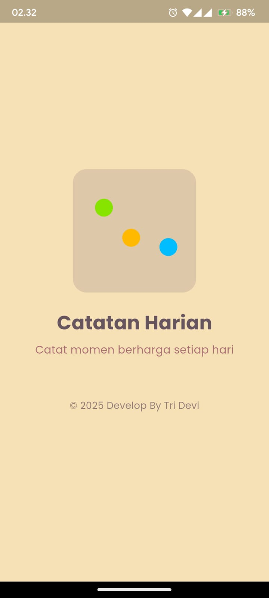
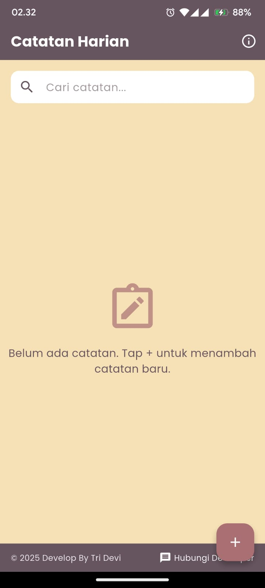
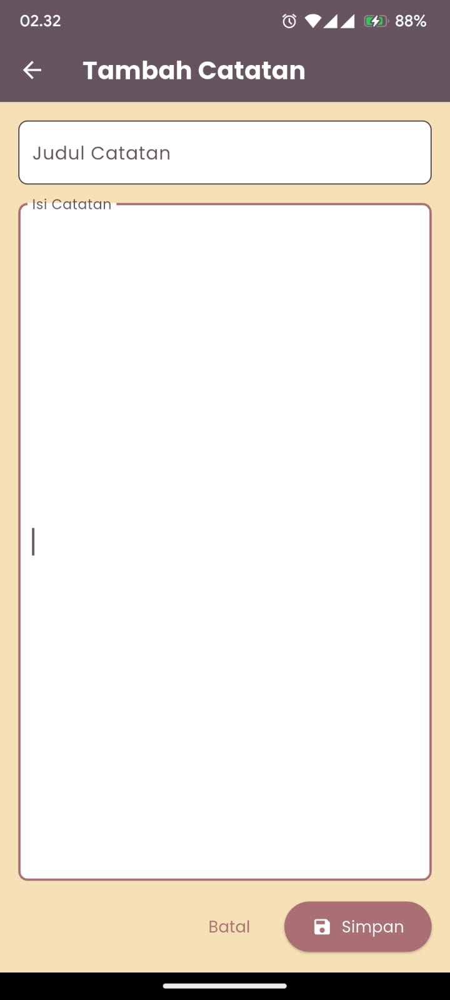
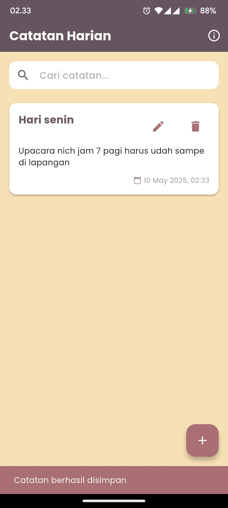
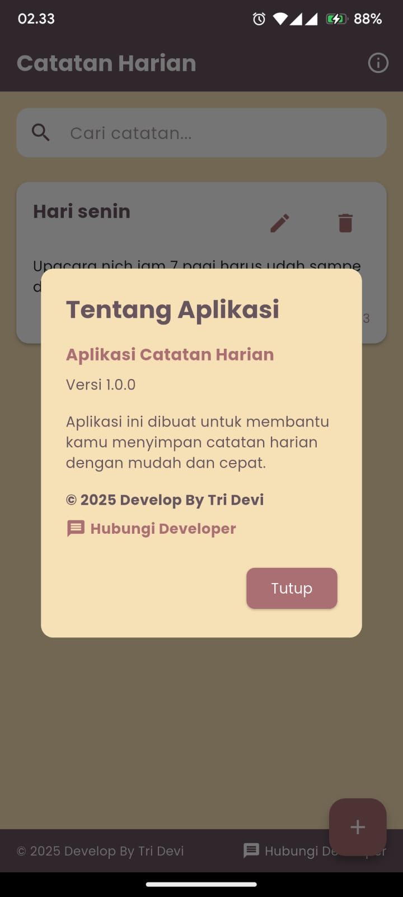

# 📝 Daily Note Flutter

<div align="center">


<p align="center">
  
</p>

**Aplikasi catatan harian sederhana dengan tampilan elegan dan fungsionalitas lengkap**

[Fitur](#-fitur) • 
[Screenshot](#-screenshot) •
[Instalasi](#-instalasi) •
[Struktur Project](#-struktur-project) •
[Penjelasan Kode](#-penjelasan-kode) •
[Teknologi](#-teknologi) •
[Kontribusi](#-kontribusi)

</div>

## ✨ Fitur

<div align="center">
<table>
  <tr>
    <td align="center"><br/>Tambah Catatan</td>
    <td align="center"><br/>Edit Catatan</td>
    <td align="center"><br/>Hapus Catatan</td>
    <td align="center"><br/>Cari Catatan</td>
  </tr>
</table>
</div>

- ✅ **Splash Screen Menarik** dengan animasi Lottie
- ✅ **Tambah Catatan** dengan judul dan isi yang lengkap
- ✅ **Edit Catatan** yang sudah ada dengan mudah
- ✅ **Hapus Catatan** dengan konfirmasi untuk mencegah penghapusan tidak disengaja
- ✅ **Tampilkan Daftar Catatan** dengan card yang elegan
- ✅ **Pencarian Catatan** berdasarkan judul dan isi
- ✅ **Penyimpanan Lokal** menggunakan SQLite
- ✅ **UI yang Responsif** dengan tema warna elegan
- ✅ **Design Modern** dengan material design dan animasi

## 📱 Screenshot

<div align="center">
  
  
  
  
  
</div>

## 🚀 Instalasi

```bash
# Clone repository
git clone https://github.com/Dasaraul/Daily-Note-Flutter.git

# Masuk ke direktori project
cd Daily-Note-Flutter

# Install dependencies
flutter pub get

# Jalankan aplikasi
flutter run
```

## 📂 Struktur Project

```
catatan_harian/
  ├── lib/
  │   ├── main.dart            # Entry point aplikasi
  │   ├── screens/             # Halaman-halaman dalam aplikasi
  │   │   ├── splash_screen.dart
  │   │   ├── home_screen.dart
  │   │   ├── tambah_catatan_screen.dart
  │   │   └── edit_catatan_screen.dart
  │   ├── models/              # Model data
  │   │   └── catatan_model.dart
  │   ├── services/            # Layanan backend
  │   │   └── database_helper.dart
  │   ├── utils/               # Utilitas dan konstanta
  │   │   ├── constants.dart
  │   │   └── loading_widget.dart
  │   └── widgets/             # Widget yang dapat digunakan kembali
  │       └── catatan_card.dart
  ├── pubspec.yaml             # Konfigurasi dependencies
  └── assets/                  # Asset seperti gambar dan animasi
      └── loading_animation.json
```

## 💻 Penjelasan Kode

### 🎯 Main.dart

```dart
void main() async {
  WidgetsFlutterBinding.ensureInitialized();
  await DatabaseHelper.instance.database;
  runApp(const CatatanHarianApp());
}
```

Titik masuk utama aplikasi yang menginisialisasi database sebelum menjalankan aplikasi.

### 📚 Model Data

Aplikasi menggunakan model `Catatan` untuk merepresentasikan catatan pengguna:

```dart
class Catatan {
  final int? id;
  final String judul;
  final String isi;
  final String tanggal;

  Catatan({
    this.id,
    required this.judul,
    required this.isi,
    required this.tanggal,
  });

  // Konversi dari Map ke objek Catatan
  factory Catatan.fromMap(Map<String, dynamic> map) { ... }

  // Konversi dari objek Catatan ke Map
  Map<String, dynamic> toMap() { ... }
}
```

### 🗃️ Database Helper

Kelas `DatabaseHelper` digunakan untuk mengelola operasi database:

```dart
class DatabaseHelper {
  static final DatabaseHelper instance = DatabaseHelper._privateConstructor();
  static Database? _database;

  // Inisialisasi database
  Future<Database> get database async { ... }

  // Operasi CRUD
  Future<int> tambahCatatan(Catatan catatan) async { ... }
  Future<List<Catatan>> ambilSemuaCatatan() async { ... }
  Future<Catatan?> ambilCatatanById(int id) async { ... }
  Future<int> perbaruiCatatan(Catatan catatan) async { ... }
  Future<int> hapusCatatan(int id) async { ... }
  Future<List<Catatan>> cariCatatan(String keyword) async { ... }
}
```

### 🎨 Tema Aplikasi

Aplikasi menggunakan palette warna yang elegan:

```dart
class AppColors {
  static Color primary = const Color(0xFF66545E);    // #66545e
  static Color surface = const Color(0xFFA39193);    // #a39193
  static Color tertiary = const Color(0xFFAA6F73);   // #aa6f73
  static Color secondary = const Color(0xFFEEA990);  // #eea990
  static Color background = const Color(0xFFF6E0B5); // #f6e0b5
}
```

### 📱 Screen Utama

#### 1. SplashScreen

Menampilkan animasi Lottie saat aplikasi dimulai sebelum navigasi ke layar utama:

```dart
Timer(const Duration(seconds: 3), () {
  Navigator.pushReplacement(
    context,
    MaterialPageRoute(builder: (context) => const HomeScreen()),
  );
});
```

#### 2. HomeScreen

Layar utama yang menampilkan daftar catatan:

```dart
// Menampilkan daftar catatan
RefreshIndicator(
  onRefresh: _refreshCatatanList,
  color: AppColors.tertiary,
  child: ListView.builder(
    itemCount: _catatanList.length,
    itemBuilder: (context, index) {
      final catatan = _catatanList[index];
      return CatatanCard(
        catatan: catatan,
        onDelete: () => _hapusCatatan(catatan.id!),
      );
    },
  ),
)
```

#### 3. TambahCatatanScreen

Form untuk menambahkan catatan baru:

```dart
Future<void> _simpanCatatan() async {
  if (_formKey.currentState!.validate()) {
    setState(() {
      _isLoading = true;
    });

    try {
      final tanggal = DateFormat('dd MMM yyyy, HH:mm').format(DateTime.now());
      
      final catatan = Catatan(
        judul: _judulController.text,
        isi: _isiController.text,
        tanggal: tanggal,
      );

      await DatabaseHelper.instance.tambahCatatan(catatan);
      
      if (!mounted) return;
      Navigator.pop(context, true);
    } catch (e) {
      // Error handling
    }
  }
}
```

#### 4. EditCatatanScreen

Form untuk mengedit catatan yang sudah ada:

```dart
Future<void> _updateCatatan() async {
  if (_formKey.currentState!.validate()) {
    // Logic untuk memperbarui catatan
    final catatanBaru = Catatan(
      id: widget.catatan.id,
      judul: _judulController.text,
      isi: _isiController.text,
      tanggal: DateFormat('dd MMM yyyy, HH:mm').format(DateTime.now()),
    );

    await DatabaseHelper.instance.perbaruiCatatan(catatanBaru);
    
    // Navigasi kembali ke home screen
    Navigator.pop(context, true);
  }
}
```

### 🧩 Widget

#### CatatanCard Widget

Widget card yang menampilkan catatan dalam daftar:

```dart
class CatatanCard extends StatelessWidget {
  final Catatan catatan;
  final Function onDelete;

  // UI untuk menampilkan card catatan
  @override
  Widget build(BuildContext context) {
    return Card(
      // UI Card dengan judul, isi ringkas, tanggal, dan tombol aksi
    );
  }
}
```

## 🔧 Teknologi

<div align="center">
<table>
  <tr>
    <td align="center"><br/>Flutter</td>
    <td align="center"><br/>Dart</td>
    <td align="center"><br/>SQLite</td>
    <td align="center"><br/>Google Fonts</td>
  </tr>
</table>
</div>

- **Flutter & Dart** - Framework UI dan bahasa pemrograman
- **SQLite** - Database lokal untuk penyimpanan data
- **Provider** - State management
- **Lottie** - Animasi interaktif
- **Google Fonts** - Untuk tipografi yang elegan
- **Intl** - Untuk format tanggal dan waktu

## 🤝 Kontribusi

Kontribusi selalu diterima dengan senang hati! Berikut cara untuk berkontribusi:

1. Fork repository
2. Buat branch fitur baru (`git checkout -b feature/daily_note`)
3. Commit perubahan kamu (`git commit -m 'Add some daily_note'`)
4. Push ke branch (`git push origin feature/daily_note`)
5. Buka Pull Request

## 📄 Lisensi

Project ini dilisensikan di bawah Lisensi MIT. Lihat file `LICENSE` untuk informasi lebih lanjut.

---

<div align="center">

### ⭐ Jangan lupa beri bintang jika kamu menyukai project ini! ⭐

Dibuat oleh [Tamaengs](https://github.com/dasaraul) dengan kekuatan jawa!

</div>